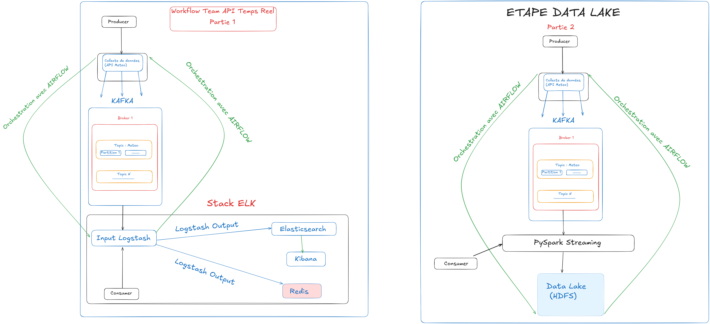

# DataFlow360 - MeteoStream Pipeline

## Présentation

**DataFlow360-MeteoStream Pipeline** est une plateforme complète de traitement de données conçue pour gérer à la fois des flux **batch** et **temps réel**. Le projet simule un environnement professionnel de bout en bout, intégrant la génération, l’ingestion, le stockage, le traitement, le monitoring et l’exploitation des données.

Ce projet a été réalisé par **Alla NIANG**, apprenant en Developpement DATA à **ODC (Orange Digital Center), Promo 7**.

## Objectifs du projet

- Créer un pipeline de données capable de traiter des flux batch et streaming.
- Mettre en œuvre les bonnes pratiques du Data Engineering, de la BI et de la Data Science.
- Conteneuriser l’architecture complète via Docker.

## Fonctionnalités clés

- **Génération de données** : Simulation de données météorologiques et scraping.
- **Ingestion & Streaming** : Kafka pour le transport des données en temps réel.
- **Traitement Big Data** : Spark (PySpark) pour le traitement distribué et Airflow pour l'orchestration des workflows.
- **Stockage** : HDFS (Hadoop Distributed File System) pour le Data Lake, PostgreSQL pour les métadonnées Airflow et le Data Warehouse.
- **Monitoring** : Stack ELK (Elasticsearch, Logstash, Kibana) pour la supervision des logs et des métriques.
- **Conteneurisation** : Déploiement modulaire via Docker Compose.

## Architecture



Le projet est structuré de manière modulaire :

- `collecte/` : Dossier principal contenant les scripts de collecte et de traitement.
    - `api/` : Contient la logique principale (Airflow, Kafka, PySpark, ELK).
    - `generation/` : Scripts de génération de données synthétiques.
    - `scraping/` : Scripts de scraping de données.
- `config/` : Fichiers de configuration pour les services (Hadoop, Kafka, Spark).
- `dashboard/` : Code source du dashboard Streamlit pour la visualisation(Incomplet).
- `init-scripts/` : Scripts d'initialisation pour les bases de données.
- `scripts/` : Scripts utilitaires pour la gestion du pipeline (`start_pipeline.sh`, `stop_all.sh`, etc.).
- **Orchestration Docker** : L'architecture est divisée en plusieurs fichiers Compose pour une meilleure modularité :
    - `docker-compose.core.yml` : Services de base (Kafka, Zookeeper, Hadoop, Spark).
    - `docker-compose.airflow.yml` : Stack Airflow (Webserver, Scheduler, Postgres).
    - `docker-compose.monitoring.yml` : Stack ELK (Elasticsearch, Logstash, Kibana).
    - `docker-compose.datawarehouse.yml` : PostgreSQL pour le Data Warehouse et PgAdmin.
    - `docker-compose.utils.yml` : Services utilitaires (YARN, HDFS Init, Streamlit).
    - `docker-compose.yml` : Fichier global (référence).

## Technologies utilisées

| Domaine             | Outils                         |
|---------------------|-------------------------------|
| Langages            | Python, Bash                  |
| Orchestration       | Apache Airflow                |
| Streaming           | Apache Kafka, Zookeeper       |
| Traitement          | Apache Spark (PySpark)        |
| Stockage & Lake     | Apache Hadoop (HDFS)          |
| Base de données     | PostgreSQL, Redis             |
| Monitoring          | Elasticsearch, Logstash, Kibana |
| Visualisation       | Streamlit, Kibana             |
| Conteneurisation    | Docker, Docker Compose        |

## Prérequis

- **Docker** et **Docker Compose** installés sur la machine.
- Une connexion internet pour le téléchargement des images Docker.

## Installation et Démarrage

1.  **Cloner le dépôt** :
    ```bash
    git clone <url_du_repo>
    cd DataFlow_Data
    ```

2.  **Démarrer le pipeline** :
    Il est **fortement recommandé** d'utiliser le script d'orchestration fourni qui gère l'ordre de démarrage des différents modules :
    ```bash
    chmod +x scripts/*.sh
    ./scripts/start_pipeline.sh
    ```
    
    *Si vous souhaitez démarrer manuellement via Docker Compose (déconseillé pour un démarrage complet), vous devez inclure les fichiers nécessaires :*
    ```bash
    docker compose -f docker-compose.core.yml -f docker-compose.utils.yml -f docker-compose.airflow.yml -f docker-compose.monitoring.yml -f docker-compose.datawarehouse.yml up -d
    ```

3.  **Accéder aux interfaces** :
    - **Airflow** : `http://localhost:8080` (Identifiants : `admin`/`admin`)
    - **Kibana** : `http://localhost:5601`
    - **Hadoop Namenode** : `http://localhost:9870`
    - **Spark Master** : `http://localhost:8090`
    - **Streamlit Dashboard** : `http://localhost:8501`
    - **PgAdmin** : `http://localhost:8081`

4.  **Arrêter le pipeline** :
    ```bash
    ./scripts/stop_all.sh
    ```

## Livrables attendus

- Code source organisé et versionné.
- Architecture conteneurisée fonctionnelle et modulaire.
- Pipelines de données opérationnels (Batch & Streaming).

## Cas d’usage

- Ingestion et traitement de données météorologiques en temps réel.
- Surveillance de l'état du pipeline via ELK.
- Orchestration de tâches complexes avec Airflow.
- Visualisation des données via Streamlit.

## Compétences mobilisées

- Ingénierie de données (Python, Kafka, Airflow, Spark, Hadoop)
- DevOps (Docker, Scripting Bash)
- Supervision de pipeline (ELK)
- Structuration de projet technique